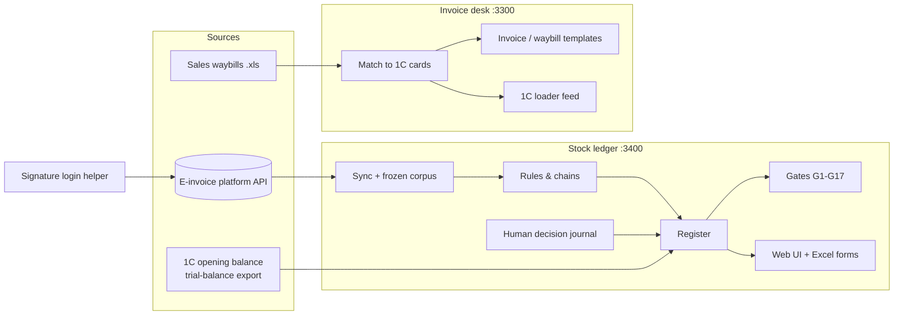
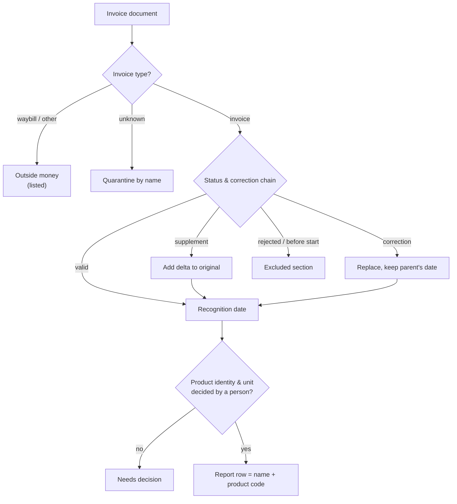

# E-Invoice Stock Ledger

A stock ledger that rebuilds a wholesaler's item-level inventory from its e-invoices and reconciles it with the accounting system.

**since Jul 2026, active · 245 commits · JavaScript (Node.js) · Python · code: private**
## The problem

A food wholesaler in Uzbekistan moved its 1C accounting to a *periodic* scheme: 1C keeps stock as a
single money total, with no quantities per item. The business still needs a monthly material report
and a stock figure on any date, per item. It also needs a way to raise outgoing invoices and
waybills without retyping every sales document.

All purchases and sales already pass through the national e-invoicing platform (Didox, ESF
invoices), so the item-level truth exists but is scattered. Invoices get corrected or rejected after
the fact. Unit and package codes on them are unreliable. Cutting and repacking between purchase and
sale never appear in any document. An honest ledger has to live with all of that without inventing
data.

## What it does

- **Rebuilds stock on any date** from the e-invoice stream, starting from the 1C opening balance:
  *opening + receipts − issues*, each movement dated by the tax-code recognition rule.
- **Produces the monthly material report and a stock-on-date statement**, on screen and as Excel
  print forms. Reports for real periods were produced from it and handed to the client.
- **Traces every amount to a source invoice line.** The opening balance must match the 1C trial
  balance to the smallest currency unit, or the build stops.
- **Makes gaps visible:** rejected, duplicate, corrected, unknown-type and missing documents go into
  named sections and gates instead of disappearing.
- **Routes judgment to people.** Operators confirm which spellings are the same product and which
  unit a line is in, working through shared queues with claim and conflict handling. The machine,
  sometimes helped by an LLM, only proposes.
- **A second tool (the invoice desk)** turns sales waybills into outgoing invoices and waybills in
  the platform's official upload templates, plus a feed for a 1C loader. The client's staff use it
  daily.

## How it works

The ledger is a pure function of the current e-invoice snapshot and is recomputed in full every time.
Documents change status retroactively, so the data never contains a closed month.

## Engineering notes

- **Money comes only from invoice lines.** A document-type gate runs before any status logic. It is
  deliberately placed in two modules. Unknown types or statuses are quarantined by name, never
  counted as zero.
- **Correction chains follow the tax rules.** A supplementary invoice is a delta; a corrected
  invoice is a full replacement recognised at its parent's date. Six chain invariants include the
  legal time limits for corrections, used as forward gates.
- **No closed months, so the cache has to be exact.** The register's cache key covers every input,
  including a content fingerprint of the human decision journal. It was introduced after a
  measured cache collision returned the wrong result.
- **The machine proposes, a person records.** Product identity and units cannot be derived from the
  documents. Decisions live in an append-only journal, each with an author and a timestamp. One
  product name under two classification codes stays two rows.
- **The cost method matches the client's 1C, including negative stock.** The rule was derived from
  the working 1C's own postings by agents that could not see this code. It was then compared with
  three open-source ERPs on the same scenarios.
- **Production runs only from a commit.** It lives in a separate copy, reports the running commit
  in its health endpoint, and restarts during a quiet window.
- **No dependencies.** The ledger uses only the Node standard library, including its own xlsx reader
  and writer, so it runs on any machine without Excel.

## How it is verified

- About 370 test scenarios for the ledger and 52 regressions for the invoice desk, run against
  an isolated server process.
- A **law registry**: each accounting rule (15 today) needs a test on the final report row with
  hand-computed numbers, plus a deliberate code mutation that must turn that test red.
- Property tests on 30 seeded random worlds for money conservation.
- 17 completeness gates that recompute the report independently, and 12 data-quality checks.
- One acceptance command. Editor hooks refuse to end a work session that touched money-related
  code without a green run.
- Independent multi-agent audits with a skeptic round, including a 13-axis audit (216 findings,
  3 critical, all closed).

## Stack

Node.js (stdlib only), vanilla HTML/JS · Python + Playwright + pywinauto (signature login) ·
PowerShell (deploy, Excel COM) · 1C exports · Didox API · optional OpenAI-compatible LLM · built
with Claude Code (hooks, subagents, skills) over 432 agent sessions.

## Access

The code is private because it runs a live business. To request a walkthrough or read access, open an issue in this repository or email eazamat360@gmail.com.
